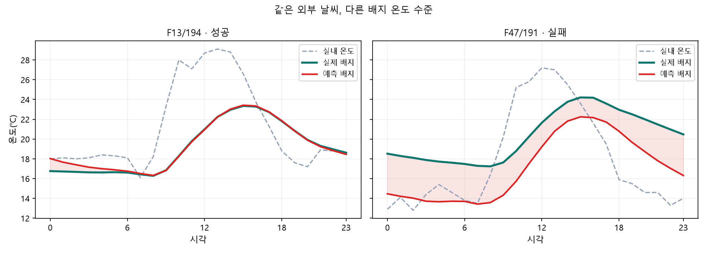

# 실패 원인과 성공 입력의 심층 추적

**현재 가장 강한 설명은 실내 온도와 배지의 하루 수준 관계가 달라진 상태를 원 모델들이 제대로 구별하지 못했다는 것이다. 온도 성공4일에서는 실내 온도 이력 묶음이 가장 큰 예측 영향을 보였고, EC 성공2일은 서로 다른 입력과 혼합 경로로 성공했다. 실제 온실의 물리 원인은 현재 자료만으로 확정하지 못했다.**

## 1. 조사 범위와 결과의 의미

- 원인: F13/194·F47/191, 앞뒤 관측, 실제 학습 분할, 원 CPU 모델18개 정확 재현, 입력 품질·시간 정렬·학습 가중치·희귀일 제거·일차 제거·희귀일 가중치20배 진단.
- 성공: 온도 F13/51·143·194, F47/72 및 EC F13/177·F47/139. 같은층 실패 대표 F13/57·F47/68, EC F13/135·F47/138도 실제 모델에서 비교했다. 전체현상 온도20일/EC31일에 입력68관계씩 총136개 서술 비교. 추가 유의성검정0개.
- 모델 영향: 같은온실·같은전후반 학습일을 정답없이 고르고, 다른 피처가 가까운5일의 같은시각 입력 묶음으로 대체. CPU1040회(2시드×5donor), 온도 PFN32문맥 및 EC PFN8문맥 추가. 전체 모델에서는 제1donor만 결합해 저온 게이트까지 재계산.
- 영향은 **입력을 바꾸면 예측 오차가 어떻게 움직이는지**다. 실제 온실에서 CO₂·온도를 조작했을 때의 인과효과가 아니다. 대체 전후 파생 피처 사이의 상관관계가 깨질 수 있고 그룹별 컬럼 수와 변경 크기도 다르다.
- 성공4/2일은 작은 사후선택표본이다. seed·문맥·donor를 독립 사례로 세지 않는다. 임계값 경계 가까운 성공을 더 어려운 날 전체에 일반화하지 않는다.

## 2. 앞선 설명을 보완한 핵심 원인

### 2.1 계산·혼합 전에 이미 낮게 잡혀 있다

F47/191 실제 배지 평균20.308℃에 대해 BASE 물리 부분17.406℃, CODEX 물리 부분17.229℃였다. 이후 잔차 평균은 각각−.320℃·−.101℃로, 부족한 수준을 높이지 못했다. 완성 BASE17.156℃·CODEX17.127℃·PFN16.982℃ 모두 낮았다. 하루 평균 오차−3.210℃, 전체SSE의93.64%가 하루 수준 오차이고24시간 모두 세 전문가 최대보다 정답이 높다. 전문가 비중만 바꾼 정답오라클도 RMSE3.118℃가 남는다(원3.317℃).

### 2.2 비슷한 상태가 학습에서 적고, 있는 상태도 원 모델이 놓친다

실제 DIAG10 fold5의 F47 후반 학습20일은 모두 배지 평균이 실내보다 낮았다. 실제 MASK 89피처 시간곡선 거리 상위5일194·196·243·195·241도 전부 같은 방향이었다. 평가191일은 배지가2.333℃ 높다. 이는 분포 차이라는 관측이고, 실패의 단독 원인이라는 입증은 아니다.

그런데 전반의 따뜻한 학습일 **F47/178은 실제 학습에 포함돼 있었다.** 원모델은 그 훈련일도 BASE RMSE3.038℃, CODEX3.934℃로 크게 놓쳤다(seed7). 따라서 “학습에 비슷한 사례가 없어서”만으로는 부족하다. 희귀 관계를 충분히 학습하지 못한 점도 확인된다.

학습에 있는 따뜻한2일(F13/109·F47/178)의 가중치만20배하면178일의 훈련 RMSE는 BASE .772℃·CODEX1.272℃로 줄었다. 반면 **평가191일은3.317→3.293℃**, 다른시드3.301→3.278℃에 그쳤다. 훈련일을 더 잘 맞추는 변화가191일의 상태 식별로 거의 전달되지 않는다. 입력 분포·표현의 차이와 관측되지 않은 상태가 남아 있다는 단서이며, 어떤 잠재변수가 원인인지 확정하지 않는다.

PFN fold5 각2000행 문맥에서 F47/178이 들어간 행 수는1·2·1·0·0·1·0·0이다.8문맥 중4개에는 그날이 전혀 없다. 온도상태를 배우는 데 희귀 관측의 지지가 약하다는 추가 단서지만, 이 수만으로 PFN 실패를 인과적으로 설명할 수는 없다.

### 2.3 다른 원인 후보를 실제로 통제했다

| 점검 | 관측 결과 | 해석 한계 |
|---|---|---|
| 원예측 재현·정답 조인 | CPU18개 최대차2.49e−14, 별도 원소스 온도/EC 재학습 차0 | 현재 코드·조인의 오류로 이 실패를 설명할 근거 없음 |
| 시간 정렬±6h | F47/191에서 lag0 RMSE3.317℃가 최저 | 시간내 단순 이동은 해결하지 못함. 실제 날짜 정렬 오류 전체를 배제한 것은 아님 |
| 결측·고착 |191일 실내온도/습도/CO₂ 각24시간 완전관측, 실내온도22종·배지24종값 | 결측/상수 고착의 직접 사례 아님. 관측값 자체의 정확성을 보증하지 않음 |
| 학습 가중치 제거 |191일 RMSE +.022~+.056℃ | 기존 가중치 제거가 해결책이라는 근거 없음 |
| 따뜻한178일 제거 |191일 RMSE −.008~+.014℃ | 이1일 포함 여부만으로 큰 실패가 생긴 설명은 약함 |
| day·second 제거 |191일 RMSE +.032℃ 두시드 | 전후반 표시 자체 제거로 해결 안 됨. 다른 날짜 지문 전체의 영향은 미배제 |
| 따뜻한 학습일20배 |훈련178일은 크게 개선, 평가191일은 약.023℃만 개선 | 훈련 적합도 개선을 새날의 일반화 개선으로 볼 수 없음 |
| 원자료 실내온도±3℃ 후 피처 재계산 |+3℃면191일 CPU변경·PFN고정 최종평균 약+1.58℃ | 실내 입력 의존성 확인. 실제 입력이3℃ 잘못됐다는 증거도 실제 보정안도 아님 |

F47/191은 훈련 잡음 탐지기에서는 가중치.2 대상으로 분류된다. 성공한 F47/72도 .2이고, 평가일 자신의 가중치는 그날 예측에 적용되지 않는다. 이를 곧바로 “잡음이라 실패했다”로 해석하지 않는다.

### 2.4 같은 날씨 안에서도 배지 수준은 달라진다

F47/190·191도 외기4종24시간96값이 같다.191일의 실내 평균은190일보다1.229℃ 높지만 배지 평균은3.854℃ 높고 예측은.910℃만 높다. F13/194와191의 경우 실내 평균은191이3.179℃ 낮지만 실제 배지는1.171℃ 높고 예측은2.205℃ 낮다. 모델이 배지 수준의 순서와 차이를 놓쳤다.

같은 날씨의 F13/56·F13/194·F47/190·F47/191은 배지 곡선 상관이 높지만 절대 수준과 진폭은 다르다. 높은 곡선 상관을 동일한 센서·날짜·열 상태의 증거로 쓰지 않는다. 원자료 실제 날짜·시설 위치·센서 위치·실내 입력의 복원표시가 없어서 자료 생성 원인과 물리 상태 원인을 분리할 수 없다.

## 3. 성공 사례에 가장 크게 영향을 준 입력

아래는 실제 학습집합의 가장 가까운 제1donor로 입력 묶음을 대체했을 때, 원혼합 전체(CPU+PFN+저온 게이트)의 RMSE 증가다. 두CPU시드 평균이며, 온도PFN은 문서화된 작은 float32 배치차를 포함하는 근사 설명값이다. 성능이 향상됐다는 숫자가 아니다.

| 성공 사례 | 가장 큰 입력 영향 | 대체 시 RMSE 증가 |
|---|---|---:|
|온도 F13/51|실내 온도와 이력 묶음|+0.627℃|
|온도 F13/143|실내 온도와 이력 묶음|+0.822℃|
|온도 F13/194|실내 온도와 이력 묶음|+2.131℃|
|온도 F47/72|실내 온도와 이력 묶음|+0.197℃|
|EC F13/177|상대일차·계절 위치 / 실내 온도|+0.198 / +0.193 dS/m|
|EC F47/139|CO₂ 현재값·0시값 묶음|+0.671 dS/m|

### 3.1 온도: 순간값보다 누적·평활 이력의 역할이 크게 나타난다

CPU5donor×2시드 검사에서 실내온도 묶음은 성공4일 모두 영향1위이고40/40대체에서 오차가 커졌다. 전체 PFN을 합친 제1donor 실험에서도4일 모두1위였다. 즉 기존 온도 모델이 성공할 때 공통으로 활용한 가장 강한 정보는 **실내 온도의 시간 변화와 이력**이다.

| 성공일 | 순간 실내온도 열만 | 당일 누적·평활 묶음 | 연속 과거시간·다일 필터 묶음 |
|---|---:|---:|---:|
|F13/51|-0.002℃|+0.755℃|+0.722℃|
|F13/143|-0.008℃|+0.096℃|+0.130℃|
|F13/194|+0.032℃|+0.805℃|+0.969℃|
|F47/72|+0.014℃|+0.075℃|+0.206℃|

이 세부 표는 PFN·게이트를 원래대로 둔 CPU부분 민감도다. 순간온도만 바꾸면 관련 누적·필터값은 원래 유지되므로 다른 열이 중복 정보를 대신 쓸 수 있다. **순간 온도가 필요 없다는 뜻은 아니다.** 당일 값과 과거필터가 상호작용하므로 각 영향 수치를 더해서 전체 기여율을 만들지 않는다.

성공4일 모두 일평균 배지가 실내보다 약2.02~2.09℃ 낮고, 낮7–16시 차이는−3.752~−6.600℃다. 모델이 큰 낮 온도차와 지연된 배지 곡선을 비교적 잘 표현했다. 반면191일은 밤+3.943℃·저녁+6.654℃로 배지 수준이 크게 높은 상태다. “절대 평균차≥2℃”라는 같은 분류 안에서도 성공4일과191일은 관계 방향이 다르다.

### 3.2 EC: 성공 두 날의 경로와 핵심 정보가 다르다

F13/177은 실제1.005 dS/m로 고EC 기준1의 경계 근처다. R3 단독 RMSE .075로 이미 잘 맞고 PFN을 더하면 .080이다. 성공의 핵심은 R3의 수준 추정이다. 전체 대체실험에서는 상대일차·계절 위치와 실내 온도가 비슷한 상위 영향이었다. CPU세부검사에서0시 실내온도를 바꾸면 평균 RMSE+.058,1–23시만 바꾸면+.024 dS/m였다(같은3donor×2시드).

F47/139는 실제1.684, R3평균1.584·PFN평균1.983으로 반대 방향 오차를 가진다. 혼합평균1.664, RMSE .078로 상쇄됐다. CO₂ 묶음이 전체제1donor 대체 영향1위였다. CPU부분에서0시CO₂를 바꾸면 평균 RMSE+.251,1–23시만 바꾸면+.055 dS/m로 **0시의 상태 정보가 더 크게 작동**했다. 실제0시CO₂는445ppm이다. 이 값이 고EC의 물리 원인이라는 뜻은 아니며, 운영상태나 날짜별 상태의 대리값으로 사용했을 가능성이 있다.

두 EC 성공일은 전반이므로 `season`은 원래 `day`와 같다. 여기서 나타난 계절 위치 영향을 외기에서 새로 얻은 계절변환의 성공 효과로 해석하면 안 된다. 또한 CPU5donor에서는 F47/139의 season·CO₂가 모두 큰 영향인 반면 제1donor 전체에서는CO₂가 더 컸다. **엄밀한 전체 중요도 순위 하나는 donor선택에 의존한다.**

F47/138 실패일에도 season·CO₂가 큰 영향을 준다. 온도 실패F13/57·F47/191도 실내온도 묶음이1위다. 입력을 강하게 사용한다는 사실과 그 입력으로 올바른 배지 상태를 식별한다는 사실을 구분한다.

## 4. 겹치는 데이터·관계와 반례

- 외기24시간 완전동일 기록이 있는 성공일은 온도 F13/194·F47/72, EC F13/177·F47/139였다. 온도 F13/51·143에는 대상두온실400일 안에서 같은 외기곡선이 없었다. 날씨복사 여부는 보편성공조건이 아니다.
- F47/72와 같은 외기를 가진 학습 F13/67·68의 배지 곡선 상관은 .995/.994로 높지만 배지 평균차는 다르다. F13/194의 날씨동일 사례들 역시 곡선은 비슷해도 성공·실패가 섞인다. 외기공통성은 모양 설명 단서일 뿐 수준 식별을 보장하지 않는다.
- 온도성공4일의 외기 표준편차4.51~5.01℃, 차광·보온 구동값 평균/변동 등에도 공통점이 보였다. 그러나 실내온도 이력 대체의 영향이 더 컸고, 구동기와 날씨는 서로 연관되어 독립 효과로 확정하지 않았다. 성공기준·온실·기간·현상강도를 바꾸면 일부 차이가 달라진다.
- EC성공2일은 실내 낮−밤 차9.559/9.918℃로 크다. 성공기준을 RMSE .15로 완화하면 그 공통차는 크게 약해진다는 앞선 분석을 이번68관계 비교에서도 확인했다. 두날의 모델영향1위도 같지 않다.
- 실제 MASK피처에서 F13/51의 가장 가까운 학습일은 F13/57(거리 .354)로 같은 차가운 배지 현상을 가지지만,57일 자신의 OOF는 실패 기준이었다. 가까운 입력·같은 현상만으로 성공을 보장하지 않는다.

## 5. 원인을 어디까지 알았는가

| 판단 | 신뢰도 | 현재 근거 / 남은 반론 |
|---|---|---|
|191일은 하루 수준을 세 모델이 함께 낮게 잡는다|높음|원자료·OOF·구성원 재현 및 분해 일치|
|단순 혼합비중·시간이동·가중치·일차표시 하나로 설명되지 않는다|높음(시험한 범위)|각 통제에서 큰 오차 유지. 모든 가능한 수정의 불가능성은 아님|
|희귀한 따뜻한 배지 상태의 학습/전이가 약하다|중간|178일 훈련 실패→가중치20배로훈련개선→191일거의불변. 부분적정규화/조건분포/미관측정보가 서로 얽힘|
|온도성공은 실내온도 이력을 가장 크게 활용한다|중간~높음(선택4일)|두시드·5donor CPU 및 원PFN전체문맥·제1donor 모두같은1위. 입력변경크기/상관/소표본 한계|
|EC성공의 큰 입력은 사례별 상대일차·0시실내온도·0시CO₂다|중간(선택2일)|원재현·단계별/시간대별대체로확인. donor에따른순위변동/상태대리값 가능성|
|배지가 실제로 왜 따뜻했는지, 실내입력이 복원변형됐는지|미확정|공식자료에 복원·변형 입력이 포함되지만 그구간은미표시. 시설·날짜·센서위치/열공급실측 정보 없음|

다음 연구에서 우선 확인할 것은 실내온도 이력과0시상태를 조건으로 **현재 입력이 설명하지 못한 배지 수준 전환의 추가 정보**가 있는지다. 성공의 공통점만 복제하거나 기존모델 가중치를 조정하면191일과 같은 관계 전환을 다시 놓칠 수 있다. 이 보고서는 새 성능 향상이나 제출 후보를 선언하지 않는다. W30G·EC계절v2 유지.

## 6. 공식 설명서 확인과 이전 해석 정정

문제설명서1쪽은 F13·F47 등의 앞부분을 온실ID로 정의하고, 온실별 상대일차 기준이 서로 다르며 실제 날짜·세부 시설정보는 제공하지 않는다고 설명한다. 따라서 **데이터상 다른 온실**로 다루며, 앞서 같은온실 안의 서로다른위치 가능성까지 열어둔 답변은 이 근거에 맞게 정정한다. 위치가 가까운지는 확인할 수 없다.3쪽은 일부 학습 입력의 통계적 복원·변형을 명시하지만 해당구간을 표시하지 않는다고 설명한다.191일의 개별 입력이 변형됐다는 확정근거는 없다.

## 7. 검산·수치 정밀도·재현

- CPU 원18fit 최대재현차 2.49e-14, 별도 원소스 온도/EC 재학습 각각차0. `verification.json` 3706체크·`additional_verification.json`244체크·`whole_verification_v2.json`4048체크 PASS(검사간 중복포함).
- 온도 PFN32문맥은 CUDA float32. 원모델 전체검증배치1개probe의차0이지만 축소배치에서는 최대0.000179℃수치차가 있었다. 첫문맥 전체/축소배치 영향차 .000118℃. 최종온도PFN영향은 근사값이며 .001℃보다 작은 변화나 가까운순위를 확정하지 않는다. 모든미실행전체배치차의 엄밀한상계는 아니다.
- EC PFN GPU원재현차 .005747 dS/m로 불합격·제외. 원CPU에서8문맥을 다시 계산해 원출력과 차0 확인. CPU혼합 후 수축·범위자름은 원식으로 수행했다.
- 초기EC열순서(day를season으로치환)재현 불합격 .06803은제외. 원식의 day제거→season뒤추가를 복원한 ec_v3만사용. 따로범위자른구성원 혼합과 원최종식의 차이는 이대체행들에서1.67e−16이었고, 최종은 원식을사용한다.
- 초기PFN엄격축소배치 불합격/전체배치v2/근사v3/원CPU EC를 각각보존하며, 수치차를 숨기거나 모델채택기준을 완화하지 않는다. `PFN_BATCH_AUDIT.md` 참고.
- 모든실험은 모델설명용. 원 outer학습과 평가날 분리, trainMASK 유지, donor정답선택0. 사후하루평균·미래값·정답gap은추론피처로사용하지 않음. EC잠금파일/예약정답읽기·재점수0, 새제출/test예측0.

최종 파일: `whole_model_effect_summary_v2.csv`/`whole_model_effects_v2.csv`/`whole_model_effect_hours_v2.csv`, `group_effect_summary_v2.csv`, `temperature_time_details.csv`, `ec_time_details.csv`, `successful_member_scores.csv`, `success_weather_overlaps.csv`, `sensor_quality.csv`, `alignment.csv`, `actual_feature_neighbors.csv`, `train_coverage.csv`, `failure_interventions.csv`, `period_control.csv`, `rare_weight_diagnostic.csv`, `temperature_context_rare_coverage.csv`. 초기버전 CSV는 최종전체영향 인용에서 제외한다.

